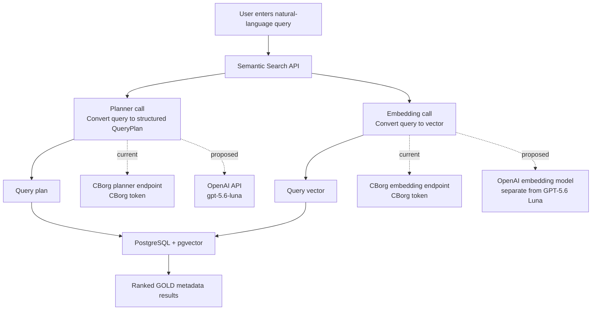
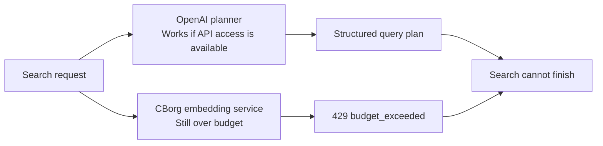

# Semantic Search Provider Migration

## Executive summary

The current search request uses two model services. Moving only the planner to OpenAI would not remove the CBorg dependency: the query must also be converted into an embedding before the database search can run.



## Why the current search is blocked

The CBorg account has reached its budget limit:

```text
Spend  = $50.01066325
Budget = $50.00
```

CBorg returns HTTP `429 budget_exceeded`. The request is rejected upstream before the application can complete the search.

## What happens if only the planner changes?



Changing the planner to OpenAI may allow query-plan generation, but the search still needs the embedding call. Therefore, the website can continue to fail with the same CBorg budget error.

## Migration options

| Option | Planner | Query embeddings | Result |
| --- | --- | --- | --- |
| Wait for CBorg refresh | CBorg | CBorg | No code changes, but unavailable until credits refresh |
| Planner-only migration | OpenAI | CBorg | Still blocked if CBorg embeddings are over budget |
| Full provider migration | OpenAI | OpenAI or another available provider | Removes the CBorg runtime dependency |
| Local embedding alternative | OpenAI | Local/other compatible embedding service | Requires compatible vectors and database preparation |

## Full migration requirements

1. Obtain a direct OpenAI API key. Codex application access alone does not necessarily provide an API credential for a local program.
2. Point the planner at the OpenAI API and use the API model ID `gpt-5.6-luna` rather than the Codex-style label `codex/gpt-5.6-luna-medium`.
3. Select a separate embedding model. GPT-5.6 Luna is the planner model; it is not the embedding model for the existing vector table.
4. Generate new embeddings for the GOLD records.
5. Store those vectors in a pgvector table with the correct dimension.
6. Update the embedding catalog and configured destination table.
7. Run readiness checks and end-to-end searches.

## Key takeaway

```text
Planner migration alone  !=  complete search migration

Complete search migration = planner + query embeddings + compatible stored vectors
```

The database and web UI do not need to be replaced. The provider boundary and embedding data pipeline are the parts that need to be changed.
